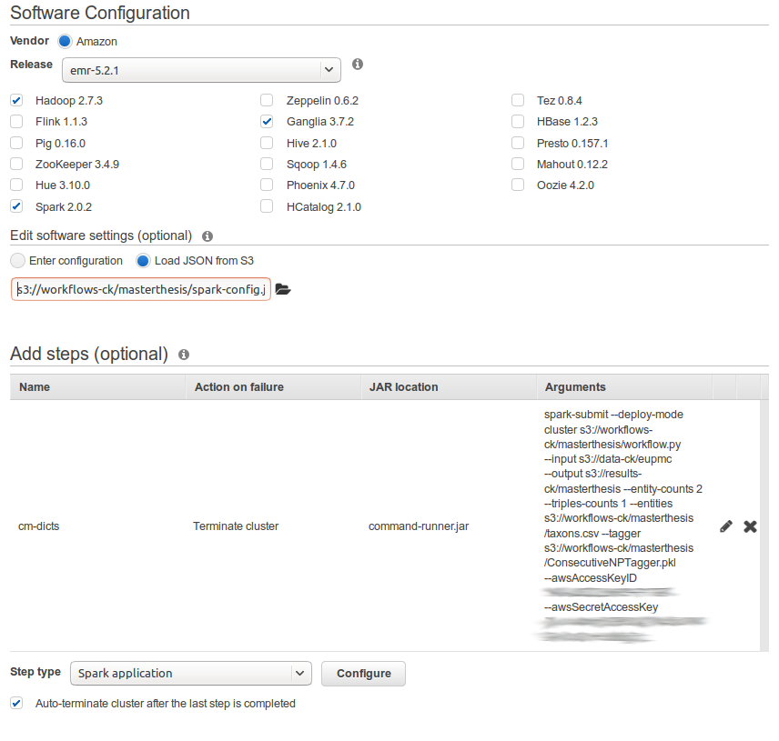
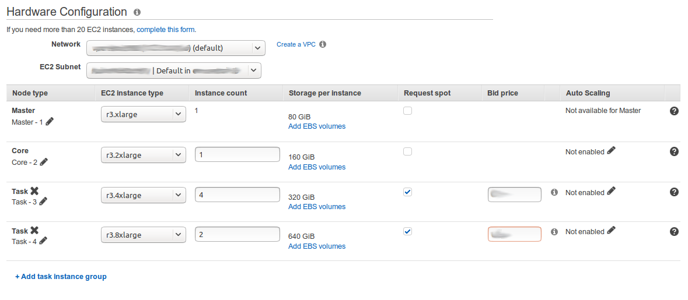
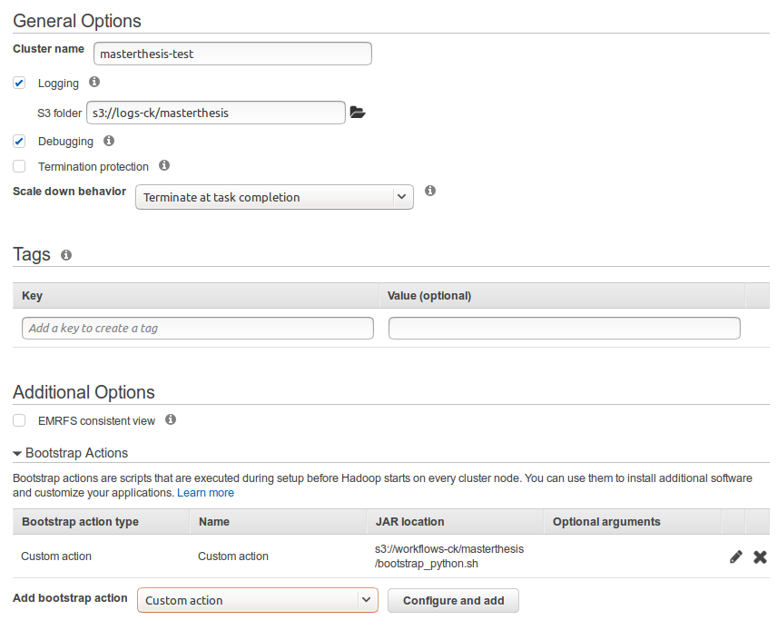

# masterthesis

## Setup

* This README assumes you have an Amazon AWS account and a key pair for ssh/scp'ing to instances. Please install AWS CLI and do `aws configure`, this makes things a lot quicker.

### Prepare S3 buckets

***Note*** Since all users on S3 share the same namespace, bucket names have to be unique. What worked for me is appending initials, for example.

* `data-ck`: going to hold raw data
* `logs-ck`: going to hold Spark logfiles
* `results-ck`: going to hold result files
* `workflows-ck`: going to hold pySpark-jobs and any additional resources like bootstrap scripts

### Preprocess raw data

Two scripts and one stylesheet do the work. For faster i/o this is best done on a small compute instance, I use Ubuntu 14.04 ami's with Anaconda 4. Please also look into setting up `boto3` and `awscli` first, this also needs to be done on the instance.

* `xml2json.py`: Contains the logic of opening a XML.gz, extracting the fulltext and metadata per article as defined by `JATS.json`, and convert it to JSON.
* `eupmc2s3.py`: Loads the fulltext corpus from EuropePMC via FTP, runs `xml2json.py` on each file, compresses the JSON to gz and uploads it to the data bucket on S3. Caching is implemented in a very basic way by simply noting down which files were processed successfully. Please be gentle and respectful when hitting other peoples server :)

1. Start an instance
1. `scp -i key.pem JATS.json ubuntu@public.dns.amazonaws.com:~/JATS.json`, also for `xml2json.py` and `eupmc2s3.py`
1. `ssh -i key.pem ubuntu@public.dns.amazonaws.com`
1. `python3 eupmc2s3.py`
1. check on S3 interface if data has arrived as expected

### Setting up a cluster

Via AWS EMR Console:

1. Choose software
  1. EMR -release (base configuration of nodes)
  1. I minimally include Hadoop (2.7.3), Spark (2.0.2), Ganglia (3.7.2) for node monitoring, optionally Zeppelin (0.6.2) if an interactive notebook is needed.
  1. software settings: Select `Load JSON from S3` and point it to the `spark-config.json` in the `workflows` folder
  1. add steps: This is where you add the actual spark-job.
    1. Give it a name,
    1. deploy mode is `cluster`,
    1. the application location of the python-file on S3,
    1. Spark-submit options: add `--py-files s3://bucket/path/pyfiles.py` for your files that you want to import from in the spark-application
    1. the arguments you provide to the application,
    1. an action on failure (I mostly terminate the cluster, except I want to ssh to master or some node after failure for manual inspection).
    It should look similar to this:
    
1. Choose hardware
  1. Network and EC2 Subnet can be left at defaults for most cases
  1. Node types:
    1. Master: I mostly use an r3.xlarge or r3.2xlarge
    1. Core: one or two r3.2xlarge for some guaranteed processing time
    1. Task: To save money, I use additional task groups from the spot market with r3.4xlarge or r3.8xlarge when high memory is needed, or some of the c4.ixlarge instances when I know that the job doesn't consume much memory per executor. Please read up on the documentation of spot market pricing and spot-instance behaviour.
    
1. General Cluster Settings
  1. General Options: Cluster name, logging (point to S3 bucket/folder), optional debugging, scale down behaviour
  1. Tags: optional
  1. Additional options:
    1. add Bootstrap options: `Custom action`: name, script location on S3, and optional arguments
    
1. Security:
  1. Choose your key par,
  1. Rest I leave on default settings - if more than 1 user is going to work with the cluster, or data shall be accessed from a different S3-account, this needs attention here

### What is in workflows-ck?

You can copy files to S3 with the AWS Command line tool, once installed and configured:

`aws s3 sync workflow s3://your-bucket/your-folder`

* `workflow.py`: Contains the main analytical workflow for pySpark
* `bootstrap_python.sh`: What each computing node has to do at startup, e.g. install additional python libraries or a nltk-corpus file
* `gazetter.py`: A custom entity recognizer - still not working as intended
* `transformers.py`: Custom transformers for Spark, e.g. sentence tokenizer
* `pyfiles.zip`: A zip file containing `gazetteer.py` and `transformers.py`
* `spark-config.json`: Spark config file specified for this analysis
* `ConsecutiveNPTagger.pkl`: Prepared tagger so that it can be re-used - will be replaced at some point by the custom gazetteer
* `taxons.csv`: A ;-separated csv file with `taxon name; taxon name, taxon alias` structure, e.g. `aacanthocnema luehmannii;aacanthocnema luehmannii`

Add all those files in the workflows bucket on S3 - when setting up the cluster you will need to point at them at configuration stage.
